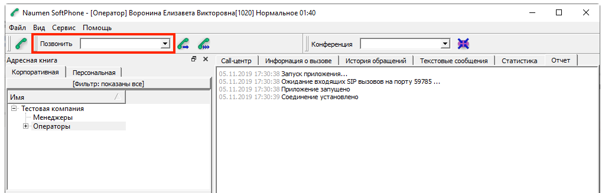
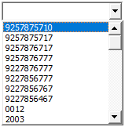
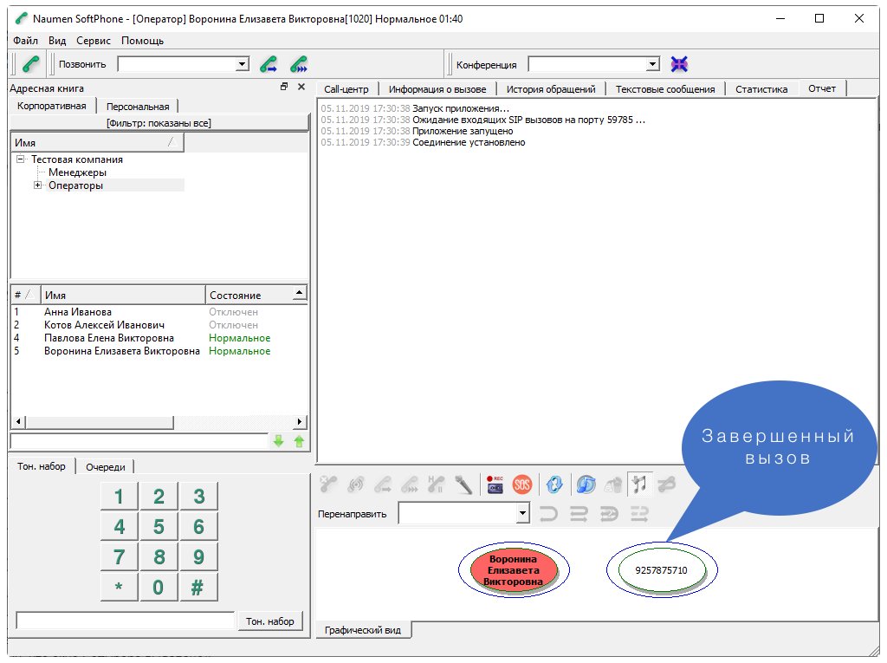
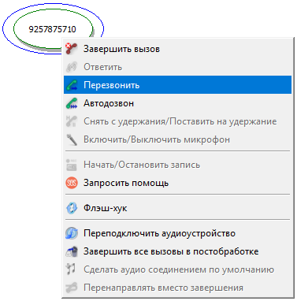

## 1. Инструкция по быстрому перезвону абоненту в Naumen SoftPhone

Существует два простых способа быстро перезвонить абоненту, с которым вы только что разговаривали:

### Способ 1: Через список последних вызовов

1. В верхней части окна программы найдите выпадающий список (он расположен под меню "Файл, Вид, Сервис, Помощь").

   
2. Нажмите на стрелку, чтобы открыть список.
3. В появившемся списке последних набранных номеров выберите нужный номер.


   
5. Нажмите кнопку "Позвонить", которая находится рядом со списком.

   

### Способ 2: Через контекстное меню

1. После завершения разговора в нижней правой части экрана будет отображаться номер телефона абонента (например, 9257875710).

   
2. Кликните по нему правой кнопкой мыши.
3. В появившемся меню выберите "Перезвонить".
   
   

Оба способа позволяют быстро набрать номер абонента без необходимости вводить его повторно. Выберите тот, который вам удобнее использовать в данный момент.

## 2. Настройка фаервола на сервере RedHat Linux с использованием iptables

Настроим фаервол с помощью iptables, чтобы контролировать доступ к серверу и повысить его безопасность:

1. **Разрешить установленные соединения**
   ```bash
   iptables -A INPUT -m state --state ESTABLISHED,RELATED -j ACCEPT
   ```
   Это правило позволяет поддерживать уже установленные соединения, его необходимо сохранить в любой конфигурации.

2. **Разрешить отклик на ping**
   ```bash
   iptables -A INPUT -p icmp --icmp-type 8 -j ACCEPT
   ```
   Позволяет серверу отвечать на ping-запросы. Если вы не хотите, чтобы сервер отвечал на пинги, можете удалить это правило.

3. **Разрешить диагностику сети (traceroute)**
   ```bash
   iptables -A INPUT -p icmp --icmp-type 11 -j ACCEPT
   ```
   Позволяет использовать команду traceroute для диагностики сети. Можно удалить, если не требуется.

4. **Разрешить работу локальных сервисов**
   ```bash
   iptables -A INPUT -i lo -j ACCEPT
   ```
   Это необходимо для работы сервисов, взаимодействующих через localhost.

5. **Открыть доступ по SSH с определённого IP**
   ```bash
   iptables -A INPUT -m state --state NEW -m tcp -p tcp --dport 22 -s 100.100.100.100 -j ACCEPT
   ```
   Разрешает SSH-подключения (порт 22) только с IP-адреса 100.100.100.100. Замените этот IP на ваш управляющий компьютер или диапазон адресов (например, 10.0.0.0/24).

6. **Разрешить UDP-трафик из локальной сети**
   ```bash
   iptables -A INPUT -m state --state NEW -m udp -p udp -s 192.168.0.0/16 -j ACCEPT
   ```
   Разрешает любой новый UDP-трафик из сети 192.168.0.0/16. Замените на вашу локальную сеть или укажите конкретные порты, если требуется (--dport номер_порта).

7. **Разрешить TCP-трафик из локальной сети**
   ```bash
   iptables -A INPUT -m state --state NEW -m tcp -p tcp -s 192.168.0.0/16 -j ACCEPT
   ```
   Разрешает любой новый TCP-трафик из сети 192.168.0.0/16. Рекомендуется ограничить список портов для повышения безопасности (--dport номер_порта).

8. **Разрешить UDP-трафик с определённого IP**
   ```bash
   iptables -A INPUT -m state --state NEW -m udp -p udp -s 200.200.200.200 -j ACCEPT
   ```
   Разрешает UDP-трафик с IP 200.200.200.200. Замените на IP-адрес нужного сервера или добавьте конкретные порты.

9. **Заблокировать весь остальной входящий трафик**
   ```bash
   iptables -A INPUT -j REJECT --reject-with icmp-host-prohibited
   ```
   Это защитное правило запрещает любые неопределённые входящие подключения. Оставьте это правило последним в цепочке INPUT.

10. **Заблокировать перенаправляемый трафик**
    ```bash
    iptables -A FORWARD -j REJECT --reject-with icmp-host-prohibited
    ```
    Блокирует весь перенаправляемый трафик. Если ваш сервер должен работать как маршрутизатор, замените на соответствующие правила.

11. **Сохранить настройки**
    ```bash
    service iptables save
    ```
    или
    ```bash
    iptables-save > /etc/sysconfig/iptables
    ```
    После сохранения правила останутся активными даже после перезагрузки системы.

### Проверка настроек

Чтобы убедиться, что правила работают корректно, выполните:

```bash
iptables -L -v
```

### Дополнительные рекомендации:

Перед изменением конфигурации убедитесь, что у вас есть альтернативный доступ к серверу (например, через консоль управления), чтобы избежать блокировки собственного IP.

---
Эти шаги помогут настроить безопасную и стабильную работу сервера.
